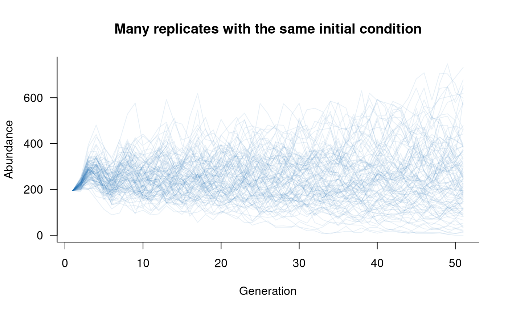

# Moving beyond default settings in aae.pop

## Introduction

`aae.pop` sets default options to speed the process of defining and
simulating population dynamics. These defaults are acceptable in some
cases but are unlikely to suit all applications. This vignette covers
the primary settings and some useful alternatives.

## Changing simulation settings

The `simulate` function has several relatively intuitive settings:

- `nsim`: the number of replicate simulations to run. The default is 1.
  Increasing this value makes sense if including any form of variation,
  such as demographic or environmental stochasticity or multiple initial
  conditions. Replicate simulations are vectorised, so including
  replicates will (in most cases) be substantially faster than multiple
  simulations with `nsim = 1`.

- `seed`: the random seed used to initialise any random draws. Defaults
  to `NULL`, in which case the seed from the current workspace is used.
  Set this value if reproducible results are required.

- `options`: these are the basic settings that control how `simulate`
  works. Several more-complex settings are described in
  [Updaters](#updaters) and [Initial conditions](#initials), below.

- `ntime`: number of time steps to simulate. Defaults to 50 and is
  ignored if covariates are included in a model because covariates
  determine the number of time steps.

- `keep_slices`: should `simulate` return every intermediate time step?
  Defaults to `TRUE`, set to `FALSE` if only the final time step is
  required. This will reduce memory use, which is helpful for large
  models.

- `tidy_abundances`: what happens to abundance estimates after each
  iteration? Defaults to `identity`, which means that abundances are
  left unchanged, potentially as decimal values. A good alternative is
  `floor`, which will round down to the nearest integer, implying that
  fractional individuals cannot exist. Can be replaced with any function
  that takes in a vector and returns a vector of the the same size
  (e.g., `ceiling`, `round`).

All of the above settings can be changed directly in a call to
`simulate`. `options` is a named list, so a modified call to `simulate`
might look like:

``` r
sims <- simulate(
  popdyn,
  nsim = 100,
  seed = 123,
  options = list(ntime = 30, keep_slices = FALSE, tidy_abundances = floor)
)
```

Alternatively, if certain settings need to be updated for all
simulations in a project, it might be easier to change these at a deeper
level through the global `options` in R. Specifically, `ntime`,
`keep_slices`, and `tidy_abundances` are all set as options and can be
updated with:

``` r
# ntime
options(aae.pop_ntime = 30)

# keep_slices
options(aae.pop_keep_slices = FALSE)

# tidy_abundances
options(aae.pop_tidy_abundances = floor)
```

## Initial conditions

Setting initial conditions is a really important part of population
dynamics modelling. The default initial conditions in `aae.pop` are
random Poisson draws with a mean of 10. This is very simplistic, and
assumes that a model will be run for many generations and that transient
dynamics are not of interest.

The default initial conditions can be changed in several ways. First,
the mean of the Poisson distribution can be changed by setting
`initialise_args` in the `options` argument to `simulate`:

``` r
sims <- simulate(
  popdyn,
  options = list(initialise_args = 20)
)
```

Alternatively, this value can be changed for all simulations in an R
session with the `options` function:

``` r
options(aae.pop_lambda = 20)
```

At a slightly deeper level, if a Poisson distribution is inappropriate,
this can be changed to any other function through the `options`
function.

``` r
# define your own initialisation function
my_initials_function <- function(n, other_arguments) {
  simulate_n_values_somehow(n = n, other_arguments)  # e.g. rnbinom, rlnorm, ...
}

# this neeeds wrapping up so aae.pop can use it
initials_function_wrapper <- function(n, args) {
  do.call(my_initials_function, c(list(n), args))
}

# set this at the global level (i.e. for an entire R session)
options(aae.pop_initialisation = initials_function_wrapper)
```

The form of the wrapper function is restricted and must include two
arguments: `n`, an integer, and `args`, a list of other arguments passed
to simulate through the `initialise_args` element of the `options`
argument. The initialisation function itself is less restricted but the
first argument must be an integer specifying the number of values to
simulate. This function cannot include structure in abundances, such as
differences among age classes or replicates.

More complex initial conditions can be passed to `simulate` with the
`init` argument. Initial conditions can be specified as a vector with
one element per population class or as a matrix (or array) with one row
per replicate and one column per population class. If specified as a
vector and `nsim` is greater than 1, the initial conditions are assumed
to be the same in all replicates. This approach allows initial
conditions with any amount of structure or detail:

``` r
# need a matrix/array with one row per replicate and one column
#    per class (5 age classes in this example)
my_initials <- matrix(
  c(
    100, 50, 25, 15, 5,   # first replicate
    200, 100, 50, 30, 10, # second replicate
    50, 25, 12, 8, 2      # third replicate
  ),
  nrow = 3,    # will set 3 replicates in simulate
  ncol = 5,    # and 5 age classes
  byrow = TRUE # this just makes formatting easier
)

# simulate with these values
sims <- simulate(
  popdyn,
  nsim = 3,
  seed = 123,
  init = my_initials,
  options = list(tidy_abundances = floor)
)

# plot this
plot(
  sims,
  col = scales::alpha("#2171B5", 0.9),
  main = "Three different initial conditions"
)
```


The previous example might be a bit unwieldy with many replicates, in
which case a single vector can be passed to simulate:

``` r
# need a vector with one value per class (5 age classes, here)
my_initials <- c(100, 50, 25, 15, 5)

# simulate with these values
sims <- simulate(
  popdyn,
  nsim = 100,
  seed = 123,
  init = my_initials,
  options = list(tidy_abundances = floor)
)

# plot this
plot(
  sims,
  col = scales::alpha("#2171B5", 0.4),
  main = "Many replicates with the same initial condition"
)
```



Alternatively, this approach could be modified to add stochasticity to
initial conditions while retaining some of the structure from the
previous examples:

``` r
# generate a matrix with one row per replicate and one column
#   per class (5 classes, 100 replicates), setting a different 
#   mean (lambda) in each column
my_initials <- matrix(
  rpois(5 * 100, lambda = c(100, 50, 25, 15, 5)),
  nrow = 100,
  ncol = 5,
  byrow = TRUE
)

# simulate with these values
sims <- simulate(
  popdyn,
  nsim = 100,
  seed = 123,
  init = my_initials,
  options = list(tidy_abundances = floor)
)

# plot this
plot(
  sims,
  col = scales::alpha("#2171B5", 0.4),
  main = "Many replicates with stochastic, structured initial conditions"
)
```


## Updaters

The update step is where abundances get updated from one time step to
the next (e.g., one generation). This process is typically the slowest
part of simulating population dynamics, at least in realistically
complex models.

### Built-in updaters

The default updater in `aae.pop` is R’s built-in cross product. This
method is extremely fast and is vectorised, so handles replicates
easily. There are two catches:

- the vectorisation will not be as efficient when there is variation in
  vital rates among replicates (a common situation).
- this approach doesn’t handle some fairly common forms of demographic
  stochasticity, such as drawing abundances from a Binomial
  distribution.

The cross product approach is still recommended in most cases, and
outperforms most R-based alternatives, including C++ tools written
specifically for matrix operations.

The updater can be changed at a global level through the `options`
function:

``` r
# change updater
options(aae.pop_update = update_my_way)
```

The `aae.pop` package includes two alternatives, which incorporate
demographic stochasticity using Binomial draws
(`update_binomial_leslie`, for Leslie matrices) or multinomial draws
(`update_multinomial`, for all other matrices). These approaches are not
as fast as the default cross product method. The
`update_binomial_leslie` method is demonstrated in the [Macquarie perch
example
model](https://aae-stats.github.io/aae.pop/articles/macperch_example.md).

### Roll your own updater

Although not trivial, it is relatively easy to define an updater using a
bespoke method. The updater function simply needs two input arguments, a
matrix of replicate population vectors and a population matrix, and
needs to return an updated matrix of replicate population vectors. The
population vectors are always provided as a matrix with replicates in
rows and classes in columns, and the population matrix will always be a
square matrix with one row/column for each class.

Looking inside the built-in updaters will give some insight into the
structure of `aae.pop` updaters. `update_crossprod` simply uses R’s
`tcrossprod` function to handle the matrix of replicate population
vectors:

    ## function (pop, mat) 
    ## {
    ##     tcrossprod(pop, mat)
    ## }
    ## <bytecode: 0x563daa454638>
    ## <environment: namespace:aae.pop>

The `update_binomial_leslie` function is slightly more complicated and
includes a check for integer abundances and then uses a mix of Poisson
(for reproduction) and Binomial draws (for survival):

    ## function (pop, mat) 
    ## {
    ##     if (!all((pop%%1) == 0)) {
    ##         stop("some abundances are not integers, so cannot be used ", 
    ##             "with update_binomial_leslie. ", "Check options()$aae.pop_tidy_abundances ", 
    ##             "and update with an appropriate method (e.g. floor)", 
    ##             call. = FALSE)
    ##     }
    ##     if (is.null(dim(pop))) {
    ##         pop <- matrix(pop, nrow = 1)
    ##     }
    ##     pop_nm1 <- pop[, -ncol(pop), drop = FALSE]
    ##     vals <- tcrossprod(pop, mat)
    ##     probs <- vals[, -1]/pop_nm1
    ##     probs[pop_nm1 == 0] <- 0
    ##     cbind(rpois(nrow(vals), lambda = vals[, 1]), matrix(rbinom(length(probs), 
    ##         size = pop_nm1, prob = probs), nrow = nrow(pop_nm1)))
    ## }
    ## <bytecode: 0x563daae192e0>
    ## <environment: namespace:aae.pop>

The primary reason to change the updater is speed. Although
`update_crossprod` is relatively fast compared to other R methods, it is
highly likely that other methods can be sped up through, for example,
the use of C++ matrix libraries (e.g., with `RcppEigen` and
`RcppArmadillo`). The final updater to use is best determined through
benchmarking of alternative updaters. Keep in mind that `aae.pop` is
built for flexibility and R compatibility rather then speed *per se*. If
speed is the primary limitation or concern, a better approach might
involve coding the entire simulation process in C++ or similar.
