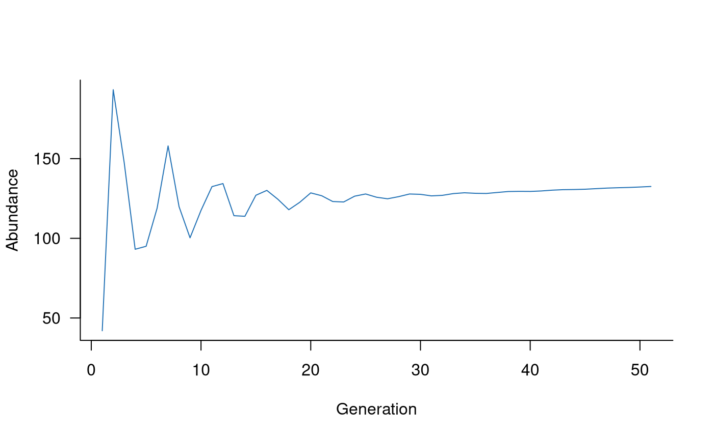

# Get started with aae.pop

## Installation and setup

You can install the `aae.pop` package from GitHub. To install from
GitHub, you’ll need the `remotes` R package, which you can install from
CRAN with:

``` r
install.packages("remotes")
```

You can then install the `aae.pop` package from Github with:

``` r
remotes::install_github("aae-stats/aae.pop")
```

Once completed, you should be able to load the `aae.pop` package with
[`library(aae.pop)`](https://aae-stats.github.io/aae.pop).

## Background

### Population models

The `aae.pop` package requires elementary knowledge of population
models. A comprehensive reference is Hal Caswell’s *Matrix Population
Models* (2nd edition, 2001, Sinauer Associates, Sunderland). Searching
for examples of *population viability analysis*, *population demographic
models*, or *matrix population models* will bring up many alternative
references.

### Matrix structures

`aae.pop` is designed for generic matrix models and makes minimal
assumptions about model structure or purpose. However, there are still
some assumptions built into the different functions and documentation.
The most important is the layout of the population matrix itself.
`aae.pop` assumes that *columns move to rows*. For example, a value in
the second row and first column of a matrix will specify a transition
from stage 1 (column 1) to stage 2 (row 2), that is, column 1 moves to
row 2. This is a common layout in population ecology but is not standard
in all disciplines.

There are two population structures used frequently in population
ecology: the *Leslie matrix* (age based) and the *Lefkovitch matrix*
(life-stage based). A Leslie matrix classifies into age classes, with
transitions restricted to reproduction or survival to the next age
class. A Lefkovitch matrix classifies individuals into life stages, with
transitions restricted to reproduction, survival to the next life stage,
or survival but remaining in the same life stage. `aae.pop` includes
several helper functions designed specifically for these two model
types. These are described in the [Including
processes](https://aae-stats.github.io/aae.pop/articles/including_processes.md)
and [Beyond
defaults](https://aae-stats.github.io/aae.pop/articles/beyond_defaults.md)
vignettes.

### Terminology

`aae.pop` uses three terms to help specify common model structures:
*reproduction*, *survival*, and *transition*. These are defined as
follows:

- reproduction: any transition to the first class (first row), often
  assumed to exclude the first column (i.e., new individuals can’t
  reproduce). This assumption is not enforced in `aae.pop`, so that
  models can include reproduction from the first class.

- survival: surviving one time step and remaining in the same class.

- transition: surviving one time stpe and moving to the next age class
  or life stage.

With these terms, a Leslie matrix has reproduction and transition
elements, whereas a Lefkovitch matrix has reproduction, transition, and
survival elements.

Of course, matrix population models can have values anywhere in a
matrix, and `aae.pop` supports any models represented as a square
matrix. This flexibility is important because some populations might
require complex structures to deal with things like metapopulations,
dormant stages, or size-based models with shrinkage as well as growth.

## Building a basic population model

The central functions in `aae.pop` are `dynamics` and `simulate`. The
`dynamics` function wraps up a population matrix and any specified
processes into a single object. The `simulate` function takes this
object and generates population projections.

### The population matrix

A good place to start is with a basic population matrix and no other
processes. For example, a Leslie matrix with five age classes can be
specified as:

``` r
popmat <- rbind(
  c(0,    0,    2,    4,    7),  # reproduction from 3-5 year olds
  c(0.25, 0,    0,    0,    0),  # survival from age 1 to 2
  c(0,    0.45, 0,    0,    0),  # survival from age 2 to 3
  c(0,    0,    0.70, 0,    0),  # survival from age 3 to 4
  c(0,    0,    0,    0.85, 0)   # survival from age 4 to 5
)
```

Using the terminology above, this same matrix could be specified as:

``` r
new_offspring <- c(2, 4, 7)
transition_probabilities <- c(0.25, 0.45, 0.70, 0.85)
popmat <- matrix(0, nrow = 5, ncol = 5)
popmat[reproduction(popmat, dims = 3:5)] <- new_offspring
popmat[transition(popmat)] <- transition_probabilities
```

Although this looks fairly unwieldy in this case, these helper terms can
be useful with large matrices.

### Creating a population `dynamics` object

Once the population matrix is defined, it can be compiled into a
`dynamics` object with the following code:

``` r
popdyn <- dynamics(popmat)
```

It is possible to plot the population dynamics object to visualise the
transitions and structure this implies. This requires the `DiagrammeR`
package. Visualising population structures can be a useful way to check
the model has been specified correctly, and these plots are easier to
communicate than a giant matrix.

``` r
plot(popdyn)
```

Plots of `dynamics` objects can use custom labels with the `labels`
argument (a character vector with one value for each class).
Additionally, the default assumption that the first stage is not
reproductive can be overwritten by passing
`cycle_first = "reproductive"` as an argument to `plot`.

### Simulating population trajectories

With a compiled `dynamics` object, it’s relatively straightforward to
simulate some population trajectories (with default settings):

``` r
sims <- simulate(popdyn)
```

Simulated trajectories can be plotted using the standard `plot` function
in R. This example sets the colour to a medium shade of blue:

``` r
plot(sims, col = "#2171B5")
```



### Changing default settings

The default settings simulate a single trajectory with 50 time steps,
from random initial conditions (Poisson draws with $\lambda = 10$).
These settings can be changed directly in the call to `simulate`:

``` r
initials <- c(100, 50, 20, 10, 5)  # some initial conditions
sims <- simulate(
  popdyn,
  nsim = 100,
  init = initials,
  options = list(ntime = 20)
)
```

Default settings also specify that population updates are calculated as
a cross product and that abundances are not rounded in any way in each
step, which allows fractional individuals in the population. These are
not ideal settings. Changing them is covered in the [Beyond
defaults](https://aae-stats.github.io/aae.pop/articles/beyond_defaults.md)
vignette.

### Summarise simulated trajectories

Simulated trajectories are arrays with dimensions of replicates (rows)
by classes (columns) by time steps (slices). These arrays are relatively
easy to summarise using `apply` functions but the `aae.pop` package
includes several basic summary functions for convenience.

A simple summary of the probability a population will hit zero
individuals at any time step, plus expected minimum population size
(EMPS), is generated with the `summary` function. This summary makes
most sense when considering replicate population trajectories because
extinction probabilities are defined as the proportion of trajectories
hitting zero individuals:

``` r
sims <- simulate(popdyn, nsim = 1000)
summary(sims)
```

    ## Simulated population has a 0 probability of extinction and expected minimum population size of 50 individuals.
    ## 
    ## The probability of population declines below non-zero thresholds is:
    ##   n = 0  n = 28  n = 56  n = 84 n = 112 n = 140 n = 168 n = 196 n = 224 n = 252 
    ##   0.000   0.001   0.797   1.000   1.000   1.000   1.000   1.000   1.000   1.000

The vector printed at the bottom of this summary is a basic risk curve
calculated from ten different extinction thresholds (described below).

The components of this summary are directly accessible:

``` r
pr_extinct(sims)
```

    ## [1] 0

``` r
emps(sims)
```

    ## [1] 50.08462

``` r
risk_curve(sims, n = 10)
```

    ##     0    28    56    84   112   140   168   196   224   252 
    ## 0.000 0.001 0.797 1.000 1.000 1.000 1.000 1.000 1.000 1.000

The default settings for `pr_extinct`, `emps`, and `risk_curve` consider
all population classes, all time steps, and define extinction as zero
individuals in the population. Many applications require more-nuanced
definitions. All three functions can be calculated for a subset of the
population (e.g., adults) and for a reduced time period (e.g.,
generations 40-50).

``` r
pr_extinct(sims, subset = 3:5, times = 40:50)
```

    ## [1] 0

``` r
emps(sims, subset = 3:5, times = 40:50)
```

    ## [1] 20.28206

``` r
risk_curve(sims, subset = 3:5, times = 40:50, n = 10)
```

    ##     0     4     8    11    15    19    23    26    30    34 
    ## 0.000 0.000 0.000 0.001 0.037 0.322 0.778 0.973 0.999 1.000

Extinction can be defined at levels other than zero individuals. For
example, a population might be considered functionally extinct or
destined to become extinct when only 100 adults remain. This
*quasi-extinction* threshold is controlled with the `threshold`
parameter to `pr_extinct`:

``` r
pr_extinct(sims, threshold = 100, subset = 3:5, times = 40:50)
```

    ## [1] 1

Risk curves are an extension of the previous idea and consider
probabilities of population declines below multiple thresholds
simultaneously. The `summary` function calculates a basic risk curve
with ten thresholds spaced evenly between zero and the maximum observed
abundance. More commonly, risk curves focus on multiple levels and might
represent categories such as extreme, high, moderate, mild, and no risk.
These values could be based on many criteria but often consider genetic
factors such as the risk of inbreeding.

``` r
risk_curve(sims, threshold = c(0, 10, 50, 100, 1000))
```

    ##     0    10    50   100  1000 
    ## 0.000 0.000 0.475 1.000 1.000

The `emps` function extracts the minimum population size within each
replicate trajectory and then averages these values over all
trajectories. This averaging defaults to an arithmetic mean but this can
be changed to any function using the `fun` argument (see
[`?emps`](https://aae-stats.github.io/aae.pop/reference/emps.md) for
details). A generalisation of this calculation is provided with the
`exps` function, where *x* represents an unknown function in place of
the minimum. With few exceptions, `emps` and `exps` require summary
functions that return single values (scalars). Even with this
restriction, `exps` allows flexible calculations to calculate many
different summary statistics. For example, it might be informative to
calculate the 95th percentile of each trajectory and then take the
median of this over all trajectories:

``` r
exps(sims, fun_within = quantile, fun_among = median, probs = 0.95)
```

    ## [1] 127.7357

The above summary functions are provided for convenient handling of
details such as subsetting the population or time steps. More
complicated functions could be implemented directly with the `apply`
function and the output `simulation` object. An example is the median
population size at each time step:

``` r
# subset the population to adults 
sims <- subset(sims, subset = 3:5)

# drop the first 10 generations (the drop = FALSE
#   argument is a safeguard that keeps the third array
#   dimension when filtering to a single time step)
sims <- sims[, , 11:51, drop = FALSE]

# sum abundances over all classes, which
#   gives a matrix (2D array) with replicates
#   in rows and time steps in columns
abundance <- apply(sims, c(1, 3), sum)

# and calculate median over all trajectories, which
#   requires keeping the second dimension (time steps)
#   while iterating over the first
apply(abundance, 2, median)
```

    ##  [1] 19.27207 17.24090 18.35532 20.53396 19.84797 18.58626 18.49707 19.50011
    ##  [9] 20.05573 19.31365 18.95322 19.31671 19.80168 19.74123 19.36984 19.42135
    ## [17] 19.71299 19.84010 19.70977 19.61029 19.75668 19.92148 19.92292 19.86478
    ## [25] 19.89903 20.01619 20.08203 20.07402 20.08156 20.14749 20.22133 20.25135
    ## [33] 20.26481 20.30572 20.36663 20.41371 20.44123 20.47413 20.52307 20.57264
    ## [41] 20.61077
