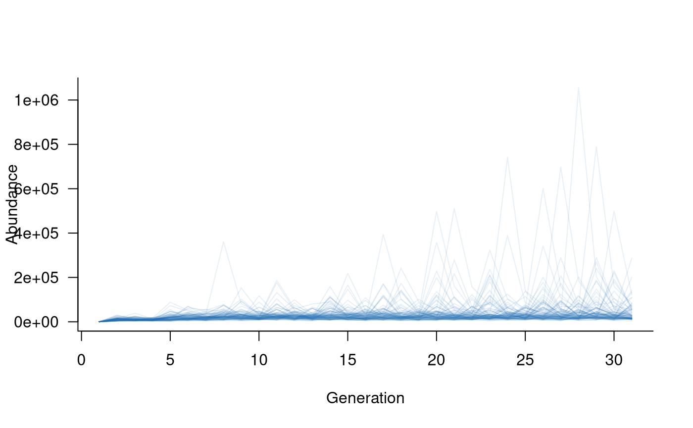
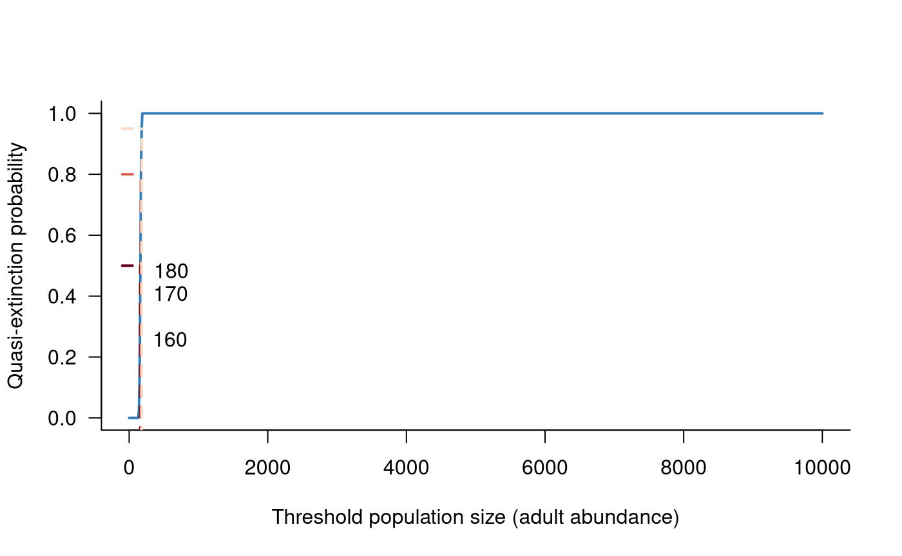

# Population dynamics of Macquarie perch

## Background

This example uses a model of Macquarie perch (*Macquaria australasica*)
population dynamics to illustrate several advanced features of
`aae.pop`. Specifically, this example demonstrates complex forms of
density dependence and the use of multiple types of `args` in
`simulate`, which supports dynamic arguments that depend on the state of
the population at each time step.

The Macquarie perch model presented here is an early implementation that
has since been updated with new information. The updated template is
included in the `aae.pop.templates` package, which can be installed from
Github with `remotes::install_github("aae-stats/aae.pop.templates")`.

Macquarie perch is a freshwater fish species native to the
Murray-Darling Basin in south-eastern Australia. Macquarie perch is a
large (up to 46 cm and 3.5 kg), long-lived (up to 30 years) species, and
was historically abundant throughout the southern Murray-Darling Basin,
supporting an important recreational fishery until the 1980s. Macquarie
perch has since undergone a dramatic decline in range and abundance, to
the point where it is now considered locally extinct across much of its
former range, and is listed as a nationally endangered species.

The model outlined here includes age-specific survival and reproduction
for 30 age classes as well as eggs and larvae. Survival and reproduction
are density dependent and spawning success varies among years. This
model includes the effects of variable flow conditions and allows
individuals (adults or juveniles) to be added or removed from the
population in any given year to simulate the effects of stocking or
recreational fishing.

## Building a population model for Macquarie perch

### The population matrix

The population matrix is the most important part of a population
dynamics model. The population matrix for Macquarie perch is
substantially more complex than in other vignettes and examples.
Notably, this matrix includes 30 age classes, with vital rates defined
as functions of age.

Individuals become reproductively mature at 3-4 years, and fecundity
increases with age (Todd and Lintermans 2015). The age-fecundity
relationship can be characterised with a three-parameter function
(derived in Todd and Lintermans (2015)). This relationship is captured
in the following R function:

``` r
# function to simulate reproductive output of Macquarie perch
fecundity <- function(
    age,                             # vector of ages
    mean = c(1.68, -0.302, 2.886),   # mean parameters for fecundity function
    early_surv = c(0.5, 0.013, 0.13) # estimates of early life survival (eggs, larvae, young-of-year)
) {

  # mean estimates of three model parameters
  y1 <- mean[1]
  y2 <- mean[2]
  y3 <- mean[3]

  # calculate fecundity
  y2_term <- exp(y2 * age)
  y1_y2 <- log(43.15 * exp(- y1 * y2_term))
  fec <- exp(2.295 * y1_y2 + y3)

  # add early life survival and muliply by 0.5
  #   to account for a 50:50 sex ratio
  0.5 * fec * prod(early_surv)

}

# plot mean fecundity as a function of age
age_vec <- seq(3, 30, length = 100)
plot(fecundity(age_vec) ~ age_vec, las = 1, type = "l", xlab = "Age", ylab = "Fecundity", bty = "l", lwd = 2, col = alpha("#2171B5", 0.9))
```


Survival has a peaked relationship with age, increasing in individuals
up to approximately 20 years of age and declining from that point
onwards (Todd and Lintermans 2015). This relationship is captured in the
following parameters:

``` r
# define survival parameters
survival_params <- c(
  0.25, 0.44, 0.56, 0.63, 0.69, 0.72, 0.75, 0.78, 0.79,
  0.81, 0.82, 0.83, 0.83, 0.84, 0.84, 0.84, 0.85, 0.85, 0.84,
  0.84, 0.84, 0.83, 0.82, 0.80, 0.78, 0.76, 0.71, 0.63, 0.48
)

# plot mean survival as a function of age
plot(survival_params ~ c(1:29), las = 1, type = "l", xlab = "Age", ylab = "Survival", bty = "l", lwd = 2, col = alpha("#2171B5", 0.9))
```


These values are sufficient to construct the (mean) population matrix:

``` r
# define population matrix
nclass <- length(survival_params) + 1
popmat <- matrix(0, nrow = nclass, ncol = nclass)
popmat[transition(popmat, dims = 1:30)] <- survival_params
popmat[reproduction(popmat, dims = 3:30)] <- fecundity(3:30)

# convert this to a dynamics object and plot it
popdyn <- dynamics(popmat)
plot(popdyn)
```

This population matrix is much more complex than the examples in the
[Getting
started](https://aae-stats.github.io/aae.pop/articles/get_started.md)
vignette, yet this form only supports deterministic projections of
Macquarie perch populations with constant vital rates and no other
processes operating (e.g., density dependence). The following sections
add several additional processes to create a more-complete model of
Macquarie perch population dynamics.

### Density dependence

Density dependence is introduced in the [Including
processes](https://aae-stats.github.io/aae.pop/articles/including_processes.md)
vignette. Macquarie perch present an interesting case study, where
density dependence operates on both reproduction, through an Allee
effect or positive density dependence, and on survival, through a
negative, top-down effect of competitive interactions for habitat (Todd
and Lintermans 2015). These effects can be captured with the following R
functions:

``` r
# masks: survival and reproduction of 3-30 year olds
density_masks <- list(
  transition(popmat),
  reproduction(popmat, dims = 3:30)
)

# top-down effects of competition for habitat,
#    arbitrary carrying capacity of 1000 here
#    (could be passed as an arg)
topdown_fn <- function(mat, pop, ...) {
  sum_n <- sum(pop[3:30])
  ifelse(sum_n > 1000, 1000 / sum_n, 1) * mat
}

# positive density dependence (Allee effect)
allee_fn <- function(mat, pop, allee_strength = 1, allee_factor = 10, ...) {
  sum_n <- sum(pop[3:30])
  allee <- (2 / (1 + exp(-sum_n / (allee_strength * allee_factor)))) - 1
  mat <- allee * mat
  mat
}

# combine the functions into a list
density_fns <- list(
  topdown_fn,
  allee_fn
)

# and collate masks and functions in a single object
dens_depend <- density_dependence(
  masks = density_masks,
  funs = density_fns
)
```

The above functions both include `...` arguments that are not used in
the functions themselves. This is necessary when non-standard arguments
are passed to `simulate` for a given demographic process. In this case,
the `allee_strength` and `allee_factor` arguments can (optionally) be
set directly in a call to `simulate`, which would pass these arguments
to all functions included in the `density_dependence` object. Without
the `...` arguments, this would break `topdown_fn` because it cannot use
the `allee_strength` or `allee_factor` terms. The `...` argument absorbs
these extra terms. Although not required in `allee_fn`, adding `...` in
this way can be a useful safeguard for models that may be updated in the
future.

### Environmental stochasticity

The population matrix and density dependence defined above are entirely
deterministic. This section will add environmental stochasticity to the
population matrix, demonstrating the relatively slow `rmultiunit`
function and a trick with the `args.fn` option to speed up `simulate` in
this situation.

#### Aside: why use a slow function?

The `runit` and `rmultiunit` functions are included in `aae.pop` to
handle situations where stochastic values are required on the unit or
\[0, 1\] interval. There are many ways to simulate values in this
interval but commonly used methods do not return values with a known
mean, standard deviation, or correlation structure (in the multivariate
case). The solution to this involves solving several relatively messy
equations to identify transformed means and standard deviations on the
real line (i.e., between negative and positive infinity), generating
random Normal variates, and converting these back to the unit interval
with a cumulative distribution transform. The `rmultiunit` function does
this but is not fast. This is a focus of future development in
`aae.pop`, likely requiring a function written in C++ or similar,
low-level language.

The `runit` function can be used as follows:

``` r
# generate 10 random values on the unit line (between 0 and 1) with known mean and sd
runit(10, mean = 0.25, sd = 0.2)
```

    ##  [1] 0.01335603 0.15140413 0.15195683 0.14524122 0.10364240 0.35541182
    ##  [7] 0.76123961 0.01913061 0.32329943 0.01232927

``` r
# repeat this, but increase the standard deviation, noting the values still sit in [0, 1]
runit(10, mean = 0.25, sd = 0.5)
```

    ##  [1] 0 0 0 0 0 0 0 1 1 0

`rmultiunit` is similar to `runit` but generates multivariate outcomes,
i.e., vectors of values. In this case, the mean and sd are vectors and
the replicates determine the number of vectors to be simulated. This
approach can also include correlation structure in the simulated values,
although this level of detail is unusual in practice due to a lack of
information on empirical correlations:

``` r
# generate 10 random vectors of 5 values each, on the unit line
rmultiunit(10, mean = c(0.5, 0.2, 0.1, 0.9, 0.6), sd = c(0.1, 0.05, 0.05, 0.05, 0.2))
```

    ##            [,1]      [,2]       [,3]      [,4]      [,5]
    ##  [1,] 0.4042997 0.1954197 0.05807149 0.8155790 0.8033768
    ##  [2,] 0.5182182 0.2086143 0.19305626 0.9139798 0.5851410
    ##  [3,] 0.3105105 0.1825705 0.07728366 0.9495308 0.6319124
    ##  [4,] 0.4343029 0.1937294 0.07989649 0.9280398 0.9738577
    ##  [5,] 0.5048048 0.2263395 0.09688891 0.7834325 0.7910241
    ##  [6,] 0.4748996 0.1860864 0.09209697 0.9101962 0.7335159
    ##  [7,] 0.2780553 0.3552867 0.07531379 0.9184629 0.8255572
    ##  [8,] 0.4316597 0.2564985 0.08013532 0.8401103 0.3867735
    ##  [9,] 0.6086022 0.2028585 0.11643803 0.8009074 0.2798417
    ## [10,] 0.5293154 0.2696519 0.10286138 0.9565959 0.7284069

``` r
# repeat this, but with a known correlation structure
omega_est <- rbind(
  c(1,    0,    0.15, 0,    0),
  c(0,    1,    0,    0.75, 0),
  c(0.15, 0,    1,    0,    0.25),
  c(0,    0.75, 0,    1,    0),
  c(0,    0,    0.25, 0,    1)
)
unit_sims <- rmultiunit(
  10000,
  mean = c(0.5, 0.2, 0.1, 0.9, 0.6),
  sd = c(0.1, 0.05, 0.05, 0.05, 0.2),
  Omega = omega_est
)
```

It is easy to verify that `runit` and `rmultiunit` return values with
approximately correct means, standard deviations, and correlations. For
the final example above, the means are:

    ## [1] 0.5 0.2 0.1 0.9 0.6

and the standard deviations are:

    ## [1] 0.10 0.05 0.05 0.05 0.20

Last, the correlations are:

    ##       [,1] [,2]  [,3]  [,4]  [,5]
    ## [1,]  1.00 0.00  0.16 -0.01  0.02
    ## [2,]  0.00 1.00  0.00  0.75  0.00
    ## [3,]  0.16 0.00  1.00 -0.01  0.25
    ## [4,] -0.01 0.75 -0.01  1.00 -0.01
    ## [5,]  0.02 0.00  0.25 -0.01  1.00

Although these values do not match perfectly, they are close and will
match increasingly well with more samples.

#### Back to environmental stochasticity

Forging ahead with the `rmultiunit` approach, this section will use a
related function (`rmultiunit_from_real`) that includes only part of the
`rmultiunit` calculation. This function takes pre-transformed estimates
of the mean and standard deviation, which removes the slowest step from
the `rmultiunit` calculation. This is possible because the mean vital
rates only change once per time step (or not at all if covariates are
not included), and all other changes to these rates (e.g., density
dependence) occur *after* incorporating environmental stochasticity.
Therefore, the conversion of means and standard deviations to the real
line can occur once per time step rather than for every single replicate
within each time step.

The first step is to define functions to use within an
`environmental_stochasticity` process. These functions will assume means
and standard deviations are already converted to their real-line
equivalents; this conversion and its use in `simulate` will be covered
below. As introduced in the [Including
processes](https://aae-stats.github.io/aae.pop/articles/including_processes.md)
vignette, the `environmental_stochasticity` process adds variation to
vital rates through a combination of masks and functions:

``` r
# define masks for environmental stochasticity
envstoch_masks <- list(
  transition(popmat),                 # all survival estimates
  reproduction(popmat, dims = 3:30)   # reproduction from all adults
)

# define a survival function, adding dots to soak up extra arguments within simulate
survival_gen <- function(mat, mean_real, sd_real, ...) {
  rmultiunit_from_real(n = 1, mean_real = mean_real, sd_real = sd_real)
}

# define a reproduction function, being careful with argument names to avoid conflicts
#   with any arguments in survival_gen, which would then require multiple different
#   arguments with the same name in simulate
reproduction_gen <- function(
    mat,
    fec_mean = c(1.68, -0.302, 2.886),
    fec_sd = c(0.3, 0.05, 0.15),
    early_mean,
    early_sd,
    ...
) {

  # need a vector of ages, hard coded here (could be an argument)
  age <- 3:30

  # generate stochastic values for early life survival (eggs, larvae, young-of-year)
  early_real <- rmultiunit_from_real(n = 1, mean = early_mean, sd = early_sd)

  # otherwise draw random variates for the three model parameters
  y1 <- rnorm(n = 1, mean = fec_mean[1], sd = fec_sd[1])
  y2 <- rnorm(n = 1, mean = fec_mean[2], sd = fec_sd[2])
  y3 <- rnorm(n = 1, mean = fec_mean[3], sd = fec_sd[3])

  # generate reproduction estimates for all adult age classes, incorporating
  #   stochastic early life estimates
  y2_term <- exp(y2 %o% age)
  y1_y2 <- log(
    43.15 * exp(sweep(y2_term, 1, -y1, "*"))
  )
  reprod <- exp(sweep(2.295 * y1_y2, 1, y3, "+"))

  # add early life survival and muliply by 0.5
  #   to account for a 50:50 sex ratio
  0.5 * reprod * prod(early_real)

}

# combine masks and functions into a single object
envstoch <- environmental_stochasticity(
  masks = envstoch_masks,
  funs = list(survival_gen, reproduction_gen)
)
```

The conversion of means and standard deviations from the unit interval
to real-line equivalents is supported by the `unit_to_real` function.
This function can be wrapped up and passed to `simulate` with the
`args.fn` option. This option allows functions to define the arguments
to demographic processes based on three inputs: the population
`dynamics` object, the state of the population at a given time step, and
the iteration index (i.e., the current year or generation). An
alternative approach is to use the `args.dyn` option, which takes a
`list` of arguments, with one element for each time step.

In this example, `args.fn` requires a function that takes the survival
estimates (on the unit interval) and converts these to their real-line
equivalents. This conversion requires information on the standard
deviations, as well as survival estimates for early life stages (eggs,
larvae, young-of-year):

``` r
transform_survival <- function(obj, pop, iter) {

  # pull out the population matrix in the current time step
  mat <- obj$matrix
  if (is.list(mat))
    mat <- mat[[iter]]

  # wrap up all survival means and SDs, including early life
  #  (this allows a single call to `unit_to_real`, which is slow)
  survival_mean <- c(
    0.5, 0.013, 0.13,     # early life
    mat[transition(mat)]  # from population matrix in current time step
  )
  survival_sd <- c(
    0.1, 0.007, 0.028,  # early life
    0.05, 0.09, 0.11, 0.10, 0.10, 0.07, 0.08, 0.08, 0.08,
    0.08, 0.08, 0.08, 0.08, 0.08, 0.08, 0.08, 0.08, 0.08, 0.08,
    0.08, 0.08, 0.08, 0.08, 0.08, 0.08, 0.08, 0.07, 0.06, 0.05
  )

  # convert unit interval to real line equivalents
  out <- unit_to_real(
    unit_mean = survival_mean,
    unit_sd = survival_sd
  )

  # separate early life from other estimates
  idx <- seq_len(nrow(out)) > 3

  # return
  list(mean_real = out[idx, 1],    # for survival_gen
       sd_real = out[idx, 2],      # for survival_gen
       early_mean = out[!idx, 1],  # for reproduction_gen
       early_sd = out[!idx, 2]     # for reproduction_gen
  )

}
```

### Adding and removing individuals

An additional process in the model of Macquarie perch population
dynamics is the inclusion of stocking or fishing. These processes could
be included directly in the population matrix through their effects on
survival and reproduction. This section demonstrates an alternative way
of accounting for the addition or removal of individuals, using the
`add_remove_post` construct, which allows density-dependent changes to
the population vector (i.e., abundances) following all other updates.
This approach requires a `mask` that selects the classes of the
population affected, as well as a `function` that determines how
population abundances are altered.

``` r
# take a population vector and update it to add or remove n individuals
#   split into two stages (juveniles, adults)
dd_n <- function(pop, n, add = TRUE) {

  # are we removing individuals?
  if (!add) {

    # check that there are enough juveniles
    if (n[1] > sum(pop[1:2])) {
      n[1] <- sum(pop[1:2])
      warning("removing more juveniles than available;",
              " total removals reduced to ", sum(pop[1:2]),
              call. = FALSE)
    }

    # check that there are enough adults
    if (n[2] > sum(pop[3:30])) {
      n[2] <- sum(pop[3:30])
      warning("removing more adults than available;",
              " total removals reduced to ", sum(pop[3:30]),
              call. = FALSE)
    }

    # expand n to remove from random age classes
    n_juvenile_by_age <- rep(1:2, times = pop[1:2])
    juvenile_idx <- sample.int(
      length(n_juvenile_by_age), size = n[1], replace = FALSE
    )
    n_juvenile <- table(n_juvenile_by_age[juvenile_idx])
    n_adult_by_age <- rep(3:30, times = pop[3:30])
    adult_idx <- sample.int(
      length(n_adult_by_age), size = n[2], replace = FALSE
    )
    n_adult <- table(n_adult_by_age[adult_idx])

  } else {

    # sample random classes to add individuals
    n_juvenile <- table(
      sample(1:2, size = n[1], replace = TRUE)
    )
    n_adult <- table(
      sample(3:30, size = n[2], replace = TRUE)
    )

  }

  # convert from a vector of classes to a count for each class
  n_juvenile_expanded <- rep(0, 2)
  names(n_juvenile_expanded) <- as.character(1:2)
  n_juvenile_expanded[names(n_juvenile)] <- n_juvenile
  n_adult_expanded <- rep(0, 28)
  names(n_adult_expanded) <- as.character(3:30)
  n_adult_expanded[names(n_adult)] <- n_adult
  n <- c(n_juvenile_expanded, n_adult_expanded)

  # adding is the opposite of removing
  if (add)
    n <- -n

  # update pop abundances and return
  pop - n

}

# wrap this up in a add_remove_post object (formerly density_dependence_n)
add_remove <- add_remove_post(
  masks = all_classes(popmat),
  funs = dd_n
)
```

The `dd_n` function above is entirely deterministic and static, that is,
a fixed number of individuals is added or removed each and every time
step. An extension of this approach could set the number of individuals
stochastically (e.g., as a Poisson random variable) and could make the
number of individuals change through time. For example, the `args`
argument to `simulate` could include a time-varying value of `n`, or the
`dd_n` function could use `pop` (actual abundances) to define a
density-dependent addition or removal scenario. These extensions are not
shown here but an example of a function argument is included in the
`macquarie_perch` template in the `aae.pop.templates` package, where it
is used to simulate changes in fishing regulations and stocking through
time.

### Covariate effects

The final demographic process included in the Macquarie perch population
model is (deterministic) covariate effects on vital rates. The
definition of these effects assumes that the vital rates shown above are
*maximum* values, with covariates reducing survival or recruitment
relative to these maximum values. Covariates are included for four
patterns observed in Macquarie perch in Lake Dartmouth:

- Recruitment of young individuals has a peaked relationship with
  discharge in November and December. Recruitment is reduced if
  discharge is below 50 % or above 100 % of the long-term average in
  this period.

- Recruitment is reduced if discharge is highly variable during November
  and December.

- Recruitment is reduced if lake level is increased substantially
  relative to the previous year.

- Adult survival is reduced if discharge into the lake drops below 100 %
  of the long-term average.

Several of these effects relate to river discharge rather than lake
conditions because adults from this population move from the lake into
the adjacent river channel to spawn.

These covariate effects can be captured with the following masks and
functions:

``` r
# effect 1: recruitment has peaked association with Nov/Dec discharge
recruit_peaked <- function(mat, x, ...) {

  # define a quadratic association with log-transformed discharge
  log_discharge <- log(x$spawning_discharge + 0.01)
  scale_factor <- exp(-0.1 * log_discharge - 0.1 * (log_discharge ^ 2))

  # make sure values are in the [0, 1] range
  scale_factor[scale_factor > 1] <- 1
  scale_factor[scale_factor < 0] <- 0

  # return re-scaled recruitment values
  mat * scale_factor

}

# effect 2: recruitment reduced in variable Nov/Dec conditions
recruit_variability <- function(mat, x, ...) {
  mat * exp(-0.05 * x$spawning_variability)
}

# effect 3: recruitment reduced with rising lake level
recruit_level <- function(mat, x, ...) {
  mat * (1 / (1 + exp(-0.5 * (x$water_level_change + 10))))
}

# effect 4: adult survival reduced by low-discharge conditions
adult_low <- function(mat, x, ...) {

  # define a quadratic association with log-transformed discharge
  log_discharge <- log(x$average_daily_discharge + 0.01)
  scale_factor <- exp(0.3 * log_discharge - 0.3 * (log_discharge ^ 2))

  # make sure values are in the [0, 1] range
  scale_factor[scale_factor > 1] <- 1
  scale_factor[scale_factor < 0] <- 0

  # return re-scaled survival values
  mat * scale_factor

}

# define masks
covar_masks <- list(
  reproduction(popmat),
  reproduction(popmat),
  reproduction(popmat),
  transition(popmat, dims = 3:30)
)

# link functions to masks
covar_funs <- list(
  recruit_peaked,
  recruit_variability,
  recruit_level,
  adult_low
)

# collate into a single object
covars <- covariates(
  masks = covar_masks,
  funs = covar_funs
)
```

The three recruitment effects all share the same mask, so there is no
reason they could not be included in a single function. Separating these
effects is useful because it allows effects to be added or removed
easily without editing the underlying functions.

All four functions also share the same input covariate, `x`, with
subsetting occurring within the functions using R’s `$` subsetting
approach. This requires that `x` is passed as a `data.frame` with column
names matching those used in the functions (`spawning_discharge`,
`spawning_variability`, `water_level_change`,
`average_daily_discharge`). The definition and inclusion of covariates
in `simulate` is shown in the following section.

## Simulating population dynamics

With demographic processes defined, it is straightforward to define a
`dynamics` object. Here, we can simply update the `dynamics` object
defined earlier:

``` r
# update previously defined population dynamics object
#   (which only included popmat)
popdyn <- update(
  popdyn,
  covars,
  envstoch,
  dens_depend,
  add_remove
)
```

Simulating from this object requires a call to `simulate`, also
recalling that at least one function argument is required here to
transform survival values from the unit interval to their real-line
equivalents:

``` r
# simulate, using the transform_survival function defined above
#   to update arguments passed to environmental_stochasticity and
#   adding arguments to specify 100 juveniles and 10 adults
#   removed per time step (e.g., due to fishing)
sims <- simulate(
  popdyn,
  nsim = 100,
  args = list(
    add_remove_post = list(n = c(100, 10), add = FALSE),
    environmental_stochasticity = list(transform_survival)
  )
)

# plot the simulated trajectories
plot(sims, col = alpha("#2171B5", 0.4))
```


The simulated abundances are extremely high given expected population
sizes in this system. The primary reason for this is that the model
assumes *ideal* conditions in each year, with covariate effects used to
reduce vital rates to match actual conditions. Covariates can be added
to this model with the following code, noting that the same `popdyn`
object can be used with or without covariates:

``` r
# simulate 30 years of covariate values based on ranges in
#   actual discharge data (covariates and functions
#   are defined based on standardised flow values)
covar_values <- data.frame(
  spawning_discharge = runif(30, min = 0.5, max = 2),
  spawning_variability = runif(30, min = 0.3, max = 3),
  water_level_change = rpois(30, lambda = 1),
  average_daily_discharge = exp(rnorm(30, sd = 2))
)

# simulate
sims <- simulate(
  popdyn,
  nsim = 100,
  args = list(
    add_remove_post = list(n = c(0, 0)),         # remove no individuals this time
    covariates = format_covariates(x = covar_values), # pass formatted covariate values
    environmental_stochasticity = list(transform_survival)
  )
)

# plot the simulated trajectories
plot(sims, col = alpha("#2171B5", 0.4))
```



The simulated trajectories now look much more realistic. Here, large
values reflect young individuals, many of which do not survive to
adulthood. Plotting older classes alone highlights this effect:

``` r
# all adults
plot(subset(sims, subset = 3:30), col = alpha("#2171B5", 0.4))
```


``` r
# ages 5 and above
plot(subset(sims, subset = 5:30), col = alpha("#2171B5", 0.4))
```


## Summarising model outputs

The model developed here can be used to forecast Macquarie perch
population dynamics on any time scale (e.g., years, decades). One
application is the generation of accurate predictions of population
dynamics on relatively short time scales (1 or 2 years). Generating
accurate predictions is challenging, even on short timescales, and
requires reliable estimates of initial conditions and future covariates.
Applications of this type can use the direct outputs of a simulation,
using replicate trajectories to characterise the distribution of
possible states on short time scales.

An alternative application is the comparison of hypothetical scenarios
on longer time scales. This approach emphasises *relative* changes in
population size or structure, with accuracy less important than relative
differences among scenarios. Applications of this type require summaries
of population trajectories over long time scales. Examples of these
summaries include extinction or quasi-extinction risk, minimum observed
population size, or effective population size if appropriate genetic
information is available. This section will demonstrate calculations of
several of these metrics, noting that bespoke metrics will be applicable
in many situations.

A common and simple summary metric is extinction or quasi-extinction
risk, which is the probability a population will fall to zero
individuals (extinction) or below a specified threshold
(quasi-extinction). This example will focus on quasi-extinction because
it is more general. The rationale behind quasi-extinction is that, below
some threshold, the population will be unable to recover sufficiently to
be viable in the future. The threshold is typically assumed to reflect
the point at which inbreeding becomes prevalent. In population modelling
terms, quasi-extinction risk is the proportion of replicate trajectories
that fall below a given threshold at any time step. This can be
calculated with the following function:

``` r
# calculate proportion of trajectories falling below a given threshold
#   in any time step. By default, all population classes are included
#   but `subset` can be used to select specific classes
calculate_quasi_extinction <- function(popsim, threshold, subset = NULL, include = FALSE) {

  # is a subset required?
  if (!is.null(subset))
    popsim <- subset(popsim, subset = subset)

  # sum population abundances over all remaining classes
  popsim <- apply(popsim, c(1, 3), sum)

  # do we want to include the threshold value in the check?
  if (include)
    threshold <- threshold + 1e-5

  # is a trajectory below a threshold?
  threshold_check <- apply(popsim, 1, function(x) any(x < threshold))

  # return proportion below threshold
  #   (mean of binary values is the proportion equal to 1)
  mean(threshold_check)

}
```

This function can be used to explore many different outputs:

``` r
# probability of 10 or fewer adults
calculate_quasi_extinction(sims, threshold = 10, subset = 3:30, include = TRUE)
```

    ## [1] 0

``` r
# probability of 1000 or fewer individuals
calculate_quasi_extinction(sims, threshold = 1000, include = TRUE)
```

    ## [1] 1

``` r
# probability of extinction of very old individuals
calculate_quasi_extinction(sims, threshold = 0, subset = 21:30, include = TRUE)
```

    ## [1] 0.14

These numbers indicate a relatively low risk of falling below threshold
population sizes at the population level but do highlight a moderate
risk of extinction of older individuals (21-30 years) during the 30 year
modelled time period.

A more general output builds on the concept of quasi-extinction but
extends this to consider a range of thresholds. This information can be
captured in a risk curve that presents the probability of falling below
any given threshold during the simulated time period. This output can be
calculated with the following function, which uses the
`calculate_quasi_extinction` function repeatedly with different values
of `threshold`:

``` r
# function to calculate quasi-extinction risk for multiple thresholds
calculate_risk <- function(popsim, min, max, n = 1000, subset = NULL, include = TRUE) {

  # create a sequence of threshold values
  thresh_seq <- seq(min, max, length = n)

  # calculate risk across the entire sequence and return
  #   a data.frame with threshold and risk values
  data.frame(
    threshold = thresh_seq,
    risk = sapply(
      thresh_seq,
      calculate_quasi_extinction,
      popsim = popsim,
      subset = subset,
      include = include
    )
  )

}

# calculate risk curve for thresholds from 0 to 10000
risk_calc <- calculate_risk(sims, min = 0, max = 10000, subset = 3:30)

# this can be plotted
plot(risk ~ threshold, data = risk_calc, xlab = "Threshold population size (adult abundance)", ylab = "Quasi-extinction probability", las = 1, bty = "l", type = "l", lwd = 2, col = alpha("#2171B5", 0.9), ylim = c(0, 1))
```


A risk curve provides information on the likelihood of hitting any given
population size at any point in time. This information can also be
presented as the abundance that a population is likely to reach with
some fixed probability. For example, it can be useful to state the
abundance a population will reach with 50 %, 80 %, or 95 % probability.
This information can be extracted from the risk curve with the following
code:

``` r
# function to calculate threshold abundance reached with probability = prob
calculate_threshold <- function(risk, threshold, prob = 0.8) {

  # find the rows in risk nearest to prob
  idx <- sapply(prob, function(x) which.min(abs(risk - x)))

  # then pull out and return these threshold values
  threshold[idx]

}

# calculate these thresholds
probs <- c(0.5, 0.8, 0.95)
thresh <- calculate_threshold(risk_calc$risk, risk_calc$threshold, prob = probs)

# plot these on the risk curve
plot(risk ~ threshold, data = risk_calc, xlab = "Threshold population size (adult abundance)", ylab = "Quasi-extinction probability", las = 1, bty = "l", type = "l", lwd = 2, col = alpha("#2171B5", 0.9), ylim = c(0, 1))
col_pal <- c("#67001F", "#D6604D", "#FDDBC7")
for (i in seq_along(thresh)) {
  lines(c(thresh[i], thresh[i]), c(-0.2, probs[i]), col = col_pal[i], lwd = 2, lty = 2)
  lines(c(-100, thresh[i]), c(probs[i], probs[i]), col = col_pal[i], lwd = 2, lty = 2)
  text(x = thresh[i], y = (probs[i] / 2), round(thresh[i]), pos = 4)
}
```



## References

Todd, Charles R., and Mark Lintermans. 2015. “Who Do You Move? A
Stochastic Population Model to Guide Translocation Strategies for an
Endangered Freshwater Fish in South-Eastern Australia.” *Ecological
Modelling* 311: 63–72.
<https://doi.org/10.1016/j.ecolmodel.2015.05.001>.
