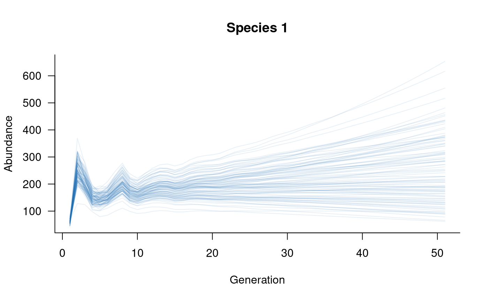

# Models of interacting species

## Background

`aae.pop` has two built-in functions to define population dynamics of
multiple, interacting species: `pairwise_interaction` and
`multispecies`. These two functions can be used to create an extended
`dynamics` object, from which it is possible to `simulate` the dynamics
of all species simultaneously. Incorporating multiple species differs
from a single-population or metapopulation model primarily because the
different species are no longer assumed to have the same matrix
structure (e.g., they can differ in number of classes). Note that this
approach could also be used for multipopulation models of a single
species if this increased flexibility is required.

It is important to keep in mind that multispecies models are difficult
to parameterise due to a lack of knowledge of species interactions,
especially interactions among specific age or size classes. In addition,
complex multispecies models (e.g., including covariates and other
demographic processes) have not been tested extensively and the
functions and methods are likely to change following further testing.

## Defining species interactions

The first requirement of a multispecies population model is a definition
of interactions among species. Without these interactions, the simulated
population dynamics will be identical to those simulated with separate,
single-species models. `aae.pop` assumes that all interactions are
pairwise, that is, species interactions do not depend on the presence or
abundance of a third species. Given the difficulty of estimating
pairwise interactions between species, it is unlikely that models with
higher-order interactions would be reliable.

Species interactions can be defined with the `pairwise_interaction`
function. This function uses the `mask`/`function` approach introduced
in the [Including
processes](https://aae-stats.github.io/aae.pop/articles/including_processes.md)
vignette. The `pairwise_interaction` function requires two additional
arguments: the population `dynamics` object for the *target* population
(species) and that of the *source* population (species). Here, *target*
refers to the species whose vital rates are influenced by the abundances
of the *source* species.

Building the simple model introduced in the [Getting
started](https://aae-stats.github.io/aae.pop/articles/get_started.md)
vignette, consider a three species system with the following population
matrices:

``` r
# define population matrices for three species
sp1_mat <- rbind(
  c(0,    0,    2,    4,    7),  # reproduction from 3-5 year olds
  c(0.25, 0,    0,    0,    0),  # survival from age 1 to 2
  c(0,    0.45, 0,    0,    0),  # survival from age 2 to 3
  c(0,    0,    0.70, 0,    0),  # survival from age 3 to 4
  c(0,    0,    0,    0.85, 0)   # survival from age 4 to 5
)
sp2_mat <- rbind(
  c(0,    0,    4),  # reproduction from 3 year olds
  c(0.25, 0,    0),  # survival from age 1 to 2
  c(0,    0.45, 0)   # survival from age 2 to 3
)
sp3_mat <- rbind(
  c(0,    0,    2,    4,    7,   10),  # reproduction from 3-6 year olds
  c(0.25, 0,    0,    0,    0,    0),  # survival from age 1 to 2
  c(0,    0.45, 0,    0,    0,    0),  # survival from age 2 to 3
  c(0,    0,    0.70, 0,    0,    0),  # survival from age 3 to 4
  c(0,    0,    0,    0.85, 0,    0),  # survival from age 4 to 5
  c(0,    0,    0,    0,    0.75, 0)   # survival from age 5 to 6
)
```

We can define population dynamics objects for each species and, with
these, define some interactions between species 1 and 3 and between
species 2 and 3:

``` r
# define population dynamics objects for each species
sp1_dyn <- dynamics(sp1_mat)
sp2_dyn <- dynamics(sp2_mat)
sp3_dyn <- dynamics(sp3_mat)

# define multispecies interactions as masks/functions
# - species 1 influencing transition probabilities of species 3
mask_1v3 <- transition(sp3_mat)

# basic Beverton-Holt function
fun_1v3 <- function(x, n) {
  # n is the population vector of the source population (sp 1)
  x / (1 + x * sum(n[3:5]) / 100) # focus on adults
}

# - species 3 influencing reproduction of species 2
mask_3v2 <- reproduction(sp2_mat, dims = 3)

# basic Ricker function
fun_3v2 <- function(x, n) {
  # n is the population vector of the source population (sp 3)
  x * exp(1 - sum(n[1:2]) / 50) / exp(1) # focus on juveniles
}

# combine masks and functions into pairwise_interaction objects
sp_int1v3 <- pairwise_interaction(sp3_dyn, sp1_dyn, mask_1v3, fun_1v3)
sp_int3v2 <- pairwise_interaction(sp2_dyn, sp3_dyn, mask_3v2, fun_3v2)
```

## Simulating multispecies dynamics

Once pairwise interactions are defined, the `multispecies` function can
be used to compile a dynamics object that can be passed to `simulate`.
Note that this function only sees the pairwise interaction objects, so a
`multispecies` dynamics object will only include those species that
interact directly with another species.

Simulation of multispecies dynamics is very similar to the
single-species case. Some key exceptions are that initial conditions and
covariates (if provided) must be lists, with one element for each
species. A single set of initial conditions will still work if all
species have the same number of classes, in which case each species is
assumed to have the same initial conditions. Providing species-level
arguments for other processes is not currently possible but is a focus
of future development. In the simplest case, multispecies dynamics can
be simulated with default initial conditions and no additional
arguments:

``` r
# compile a multispecies dynamics object
multisp_dyn <- multispecies(sp_int1v3, sp_int3v2)

# simulate
sims <- simulate(multisp_dyn, nsim = 100)
```

In this case, the `simulate` function returns a list with one element
for each species. These individual elements can be handled in the same
way as single-species models, but `aae.pop` can also work directly with
the multispecies output. For example, the `plot` function for a
multispecies `simulation` object will plot all species in separate plots
by default, and takes an optional `which` argument that specifies which
species to plot:

``` r
# plot
plot(sims, which = 1, col = scales::alpha("#2171B5", 0.4), main = "Species 1")
```



``` r
# plot
plot(sims, which = 2, col = scales::alpha("#2171B5", 0.4), main = "Species 2")
```


``` r
# plot
plot(sims, which = 3, col = scales::alpha("#2171B5", 0.4), main = "Species 3")
```


